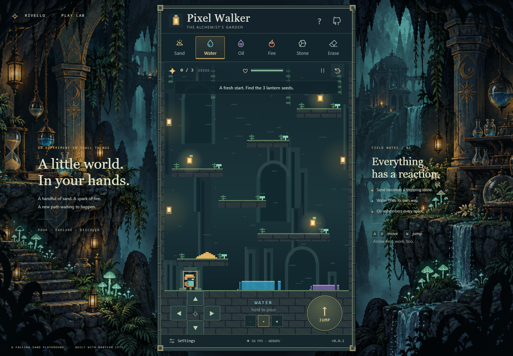

# Pixel Walker

A little world in your hands. Pour sand, water, oil, and fire into an enchanted cavern, then walk, jump, and swim through the result. Find three lantern seeds and bring them back to the gate—or just keep experimenting.

**[Play Pixel Walker](https://samuelasherrivello.github.io/babylon-lite-pixel-walker/)** · [Releases](https://github.com/SamuelAsherRivello/babylon-lite-pixel-walker/releases)

## Images

<a href="pixel-walker/documentation/screenshot01.png"></a>

## Original AI Prompt

<details>
<summary>Read the full original prompt (edited for grammar, punctuation, spelling, and formatting)</summary>

Use this template:

[https://github.com/SamuelAsherRivello/github-repository-template](https://github.com/SamuelAsherRivello/github-repository-template)

Create a new GitHub repository called `babylon-lite-pixel-walker`, with the project name `pixel-walker` in the repository and “Pixel Walker” in display text.

Use the Babylon Lite engine specifically to create a browser game using WebGPU. The game must have a portrait aspect ratio, with new, original artwork in the borders and gutters. The aspect ratio and gutters can draw inspiration from:

[https://github.com/SamuelAsherRivello/babylon-light-stealth-grid](https://github.com/SamuelAsherRivello/babylon-light-stealth-grid)

Import the skills from:

[https://github.com/SamuelAsherRivello/ai-skills-library](https://github.com/SamuelAsherRivello/ai-skills-library)

Then use `$explore`, followed by `$propose`, to create a complete game with the following goal:

Make a game where the character uses an on-screen virtual controller, WASD, and the arrow keys to walk around a 2D side-view level. The level must fit on one screen, with no scrolling.

Add buttons in the top navigation that let the user choose substances such as sand, water, oil, and fire. The cursor then drops the selected substance into the world, like sand pouring from a hand.

Include options to change the resolution of the world. Smaller particles will be slower to run but provide higher fidelity.

[https://store.steampowered.com/app/881100/Noita/](https://store.steampowered.com/app/881100/Noita/)

Do not ask me any questions. Keep working until the project is on GitHub, released, and playable through a working live demo link published to GitHub Pages.

This ChatGPT thread points to a local folder intended to be your new working directory. When you are done, the project must exist as a local copy with no uncommitted changes, and the full code must be on GitHub.

[$github](app://connector_76869538009648d5b282a4bb21c3d157)

</details>

- **Recorded execution time:** 48 minutes, 28 seconds (completed project goal timer; not total chat duration).
- **AI model:** OpenAI GPT-6 Astra (`gpt-6-astra`) in Codex. The initial turn used GPT-5.6 Luna (`gpt-5.6-luna`).
- **Intelligence level ([reasoning effort](https://developers.openai.com/api/docs/guides/reasoning)):** High (`high`) for the main build; Medium (`medium`) for the initial turn. Model and effort values are from this chat's session log.

## Live Demo

[Launch the browser game](https://samuelasherrivello.github.io/babylon-lite-pixel-walker/). Requires a WebGPU-capable browser and graphics device. Current Chrome or Edge with hardware acceleration is the tested path. Unsupported devices get a readable retry screen; there is no alternative rendering engine.

## How to play

Collect the three golden lantern seeds, then return to the gate at the lower left. A victory screen lets you replay or continue experimenting.

| Action | Keyboard / mouse | Touch |
| --- | --- | --- |
| Walk | A / D or left / right arrows | Directional pad |
| Jump / swim up | W, Up, or Space | Up or Jump |
| Swim down | S or Down | Down |
| Pour | Select a substance; hold and drag in the cavern | Hold/drag with another finger |
| Choose material | Top toolbar or keys 1–6 | Top toolbar |
| Brush size | Three dots below the world | Three dots |
| Pause / reset | P / R or toolbar buttons | Toolbar buttons |
| Rescue / resolution / fullscreen | Settings | Settings |

Sand settles into piles and supports the walker. Water flows below oil and extinguishes flames into steam. Oil spreads and burns when touched by fire. Stone creates stable platforms; Erase clears a path. Fire damages the walker, but a safe respawn preserves collected seeds. Settings also has a rescue action.

### Particle resolution

- **Coarse:** 90 × 160 cells; larger grains and lowest CPU cost.
- **Balanced:** 180 × 320 cells; the default.
- **Fine:** 270 × 480 cells; smaller grains, more detail, and higher CPU cost.

Changing resolution starts a fresh expedition. The level, character, and frame retain the same physical proportions. Pausing, opening a dialog, losing focus, or hiding the tab stops play. Resume with P or the play button.

## Getting started

Use Node.js 22.12+ (CI uses Node 24) and npm. Run commands from the repository root.

```sh
npm ci
npm run dev
npm test
npm run build
npm run preview
```

Open the localhost URL Vite prints, including `/babylon-lite-pixel-walker/`. The build output is `pixel-walker/dist/`.

For browser verification:

```sh
npx playwright install chromium
npm run test:browser
```

Tests use full Chromium and WebGPU, verify real keyboard/touch input, complete the collection route, and check desktop/mobile framing and unsupported-device handling. GPU availability is required for gameplay tests. Browser output is ignored under `test-results/`. No formatting command is configured.

See the [delivery verification record](pixel-walker/documentation/verification.md) for public-demo test evidence, release/deployment runs, and known limitations.

## Project details

- **Rendering:** pinned `@babylonjs/lite@1.25.0`, a WebGPU engine, nearest-sampled dynamic texture, and one sprite draw call. A detached Canvas 2D composes original pixel art before Babylon Lite uploads and renders it.
- **Simulation:** fixed 60 Hz CPU cellular materials, typed arrays, alternating scan direction, moved-cell stamps, density displacement, reactions, and finite gas/flame lifetimes. At most four catch-up ticks run per rendered frame.
- **Character:** swept axis collision against the same cell grid, grounded jump/coyote time, swimming, fire damage, safe recovery, and a complete seed/portal goal.
- **Presentation:** fixed 9:16 portrait frame, original illustrated gutters, a responsive HTML control layer, keyboard focus styles, accessible labels, and independent captured pointers.
- **Privacy:** fully static; no account, backend, analytics, remote fonts, or credentials.

### Structure

```text
pixel-walker/
  src/
    world.js       # Materials, level, player, and objective
    renderer.js    # Babylon Lite renderer and original pixel art
    input.js       # Keyboard, pointer, and multitouch controls
    main.js        # Interface and fixed-step game loop
    game.css       # Portrait frame, borders, and gutters
  public/art/      # Original artwork and lantern icon
  test/            # Physics tests and real-browser tests
  documentation/   # Screenshot, provenance, and verification notes
openspec/           # Proposal, specifications, and implementation record
.agents/skills/     # Imported shared skills and template skills
.github/workflows/  # Pages deployment and patch release
```

### Release and deployment

The repository inherits and adapts the supplied template's workflows. Push `main` to deploy GitHub Pages. `version.txt` is the single version source; the manually dispatched **Release** workflow installs dependencies, runs tests/build, increments the patch, commits, tags, and creates a GitHub release.

```sh
gh workflow run release.yml --ref main
# After the Release run succeeds:
gh workflow run deploy-pages.yml --ref main
git pull --ff-only
```

The second dispatch is intentional: a workflow's GITHUB_TOKEN push does not trigger another push workflow. Always verify the release tag, successful deployment, and public game before declaring delivery complete.

## Credits

- Samuel Asher Rivello — Over 25 years of game development XP (2026).
- [Repository template](https://github.com/SamuelAsherRivello/github-repository-template): initial structure, attribution, and release/deploy workflows.
- [AI Skills Library](https://github.com/SamuelAsherRivello/ai-skills-library): shared workflow skills, imported as physical copies.
- [Stealth & Steel layout reference](https://github.com/SamuelAsherRivello/babylon-light-stealth-grid): portrait-frame and gutter inspiration only.
- [Noita](https://store.steampowered.com/app/881100/Noita/): inspiration for interacting simulated materials; no source, branding, or assets copied.
- Original gutter artwork generated with OpenAI's built-in image tool; game sprites, icon, stone borders, and terrain are original code-authored artwork. [Art provenance and prompt](pixel-walker/documentation/art-provenance.md).
- [Babylon Lite](https://github.com/BabylonJS/Babylon-Lite) is Apache-2.0 licensed.

### Contact

- [LinkedIn.com/in/SamuelAsherRivello](https://Linkedin.com/in/SamuelAsherRivello) ⭐
- [GitHub.com/SamuelAsherRivello](https://github.com/SamuelAsherRivello/)
- [Twitter.com/srivello](https://twitter.com/srivello/)
- Resume / Portfolio: [SamuelAsherRivello.com](http://www.SamuelAsherRivello.com)

### License

Provided as-is under the [MIT License](LICENSE).

Copyright © 2026 Rivello Multimedia Consulting, LLC.
